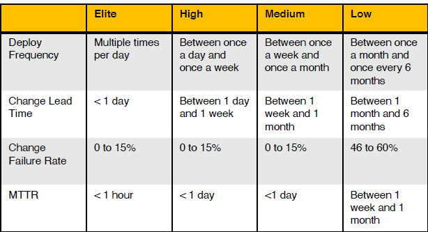

# Agile Enablers
## From Vighneshs roadmap it is about 
#####################
## Culture
## Communication 
## Dev Practices 
## Measurements 

#######################

### Always start with end in mind. 
## For end, we need to know current state.

# Step wise approach to determine current state 

# Baseline our metrics 
* from accelerate
* 
* many tools available to measure. 

# Baseline our tools 
* importance of tools as Vighnesh rightly mentions is understated

## document the following 
* Source control (e.g., Github, Gitlab, Bitbucket)
* Code reviews (e.g., pull requests, merge requests,    codewalkthroughs)
12
* Automated testing - CI (e.g., Jenkins, CircleCI, GitHub Actions)
* Deployments - CD (e.g., AWS CodeDeploy, Harness, Jenkins)
* Observability (e.g., Datadog, New Relic, CloudWatch)
* Error tracking (e.g., Sentry, Rollbar, Bugsnag)
* Feature flagging (e.g., LaunchDarkly, Split, Cloudbees)
* Deployment environments (e.g., Production, Staging, QA)
* Configuration as code (e.g., Terraform, Chef, Puppet)

# Baseline Communication 
## Tools
* Issue tracking (e.g. Jira, Pivotal tracker, Linear)
* Chat tools (e.g. Slack, Teams, Discord)*
* Visibility - deployment tracking (e.g. Sleuth, Harness)
* Knowledge sharing (e.g. Google Docs, Confluence, Notion)

## Developer Comms 

* How often do our developers work together? Through what
means? Slack? Issue tickets? Pair programming? Code reviews?
* How do we communicate processes, like deploys, to our team?
* How does our team improve? What processes exist for this?

## Operations 

* How do we understand the health of our deployment
environments? Is this available to all or just an anointed team? How
hard is it to find the right information?
Intra-team communication
* How do our developers communicate with external stakeholders
such as product managers and designers? How often and how
directly? Hourly, daily, weekly, monthly? Only through a proxy?
Extra-team communication
* How does the rest of the company know what our team has
accomplished?
* How do others know what our goals are and if me’re hitting them?
* How do other functions that rely on our work know when it’s done?

# Baseline Culture
## Culture of safety
* How does our team verify production is in a healthy state?
* How blameless is our team when we encounter incidents?
* Are our developers supported in creating the tests and
environments that allow for them to safely make change?
## Culture of confidence
* How do we gain confidence in the changes we release?
* Do Product Managers, Engineering Managers, design and
engineering feel like they’re on the same team? Do they trust each
other’s work? How do they verify this?
* Does our team know how to ship and verify incrementally and
“incomplete” changes or does it only know how to do this at the
feature level?
## Culture of openness
* How does our team communicate about what’s changing?
* How does our team define success? Is this measure open to the
team, the execs, and the entire company?
* Is it ok for our team to fail and learn? How does our team support
this?

## Culture of responsibility
* Do individuals own their work?
* Do our developers own their code? At what point are they no
longer able to “see a change through”? (dev, testing, review, merge,
staging, prod)
* Do individuals feel empowered to improve the processes they work
within?
* When things break is it our problem or someone else's problem?
* Who owns reliability?

# Once we average each section, we will get a score which tells us where we should go next in an objective manner. 

